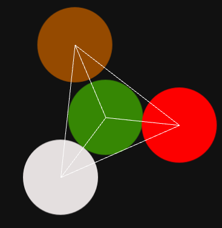
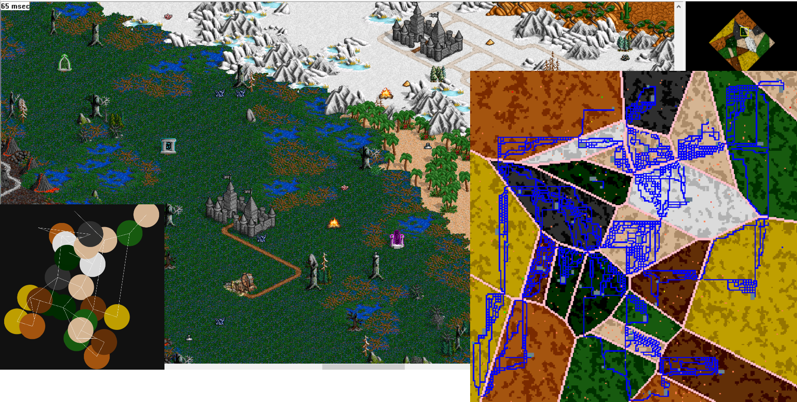

# Korge mapgen

This is a korge map generator for [Pocket Palm Heroes remastered](https://github.com/SerVB/pph) (PPH).

## Algorithm

Is based mostly on [presentation](https://en.ppt-online.org/29091) by Gus Smedstad, who is the HoMM3 programmer. Unfortunately, presentation does not contain any code (yet there are some guidelines).

5 steps:

- [x] Parse a map template file (examples are in `/resources`)
- [x] Place circles with connecting segments
- [x] Create Voronoi Diagram from circle centers 
- [x] Restructure diagram into a grid of cells, where each cell represents an empty tile. 
- [ ] Make jagged zone edges and rebalance zone sizes
- [x] Add edges between zones
- [x] Add castles and mines in each zone
- [x] Create passages and portals between zones
- [x] Connect castles and mines with roads
- [x] Populate all tiles (obviously the most complex step, but for now it is enough to get the basic idea)

## Parse template map and config

## Place circles and connecting segments
*Looking back, it seems that implementing that algorithm wasn't a good choice. It is not effective for many zones (more than 10 estimate). Maybe I should've looked more into planar graph representations*

## Restructure circles into Array2

Add edges

## Add castles and mines
Now zone can have only one castle which is placed in center of mass. All mines are placed in a circle with center of mass as its center.

## Add passages and portals

## Connect isolate parts
Using [A*](https://www.redblobgames.com/pathfinding/a-star/introduction.html) pathfinding algorithm

## Adding roads

## Adding guards

## Adding treasures
Choose random empty cells in a map, randomly place resources, mana crystals, campfires and artifacts (is represented as color)

##  Export to hmm
hmm is a file format for  PPH map editor

Here is how an incomplete second step looks like:

