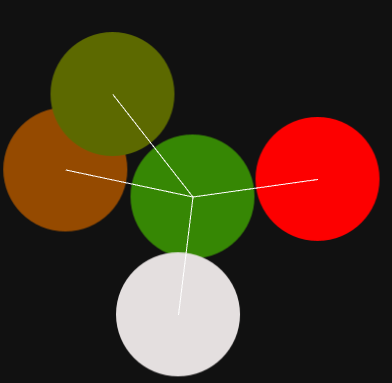

# Korge mapgen

This is a korge map generator for [Pocket Palm Heroes remastered](https://github.com/SerVB/pph).

## Algorithm

Is based mostly on [this presentation](https://en.ppt-online.org/29091) by Gus Smedstad, who is HoMM3 programmer.

4 steps:
1) Place circles with connecting segments
2) Create Voronoi Diagram from circle centers
3) Restructure diagram into a grid of cells, where each cell represents an empty tile.
4) Populate all tiles (obviously the most complex step, but for now it is enough to get the basic idea)

Here is how an incomplete first step looks like:

