# Korge mapgen

This is a KorGE map generator for [Pocket Palm Heroes](https://github.com/SerVB/pph) (PPH).

## Running

To run the generator, either load [jar](/coursework-all.jar) or build whole project and run with commands:

```
# Run generator:
./gradlew :runJvm      # for Linux/Mac
.\gradlew.bat :runJvm  # for Windows
```

Java needs to be installed.

### Customizing templates and config.

If executed from the jar file, default config and template are in `/src/commonMain/resources`. To run with a different
template, execute jar from the console with this command: `java -jar coursework-all.jar $TEMPLATE_PATH $CONFIG_PATH`.

It is recommended to put jar and jsons into one folder. Config and template arguments are optional.

Template examples are [here](templates).

## Future work

This project will be later added to [PPH](https://github.com/SerVB/pph).

There are many ToDos scattered across code and markdown files. Feel free to create a pull request that fixes ToDo.

Known issues are described [here](docs/issues.md). Add new issue to the issues or fix an existing one by offering a pull
request.

### Highest priority changes and fixes

1. Implement a fast way of creating JSON templates and configs (might be a small window application, where to create a
   config, a form with checkboxes and integer ranges should be filled. For template creation, fill a similar form with
   basic graph representation, something like [this](https://h3hota.com/en/templates)).
2. Redo [zone placement](https://github.com/Alex5041/MapGen-KorGE#2-place-circles-with-connecting-segments).
3. Redo [road placement](https://github.com/Alex5041/MapGen-KorGE#8-connect-castles-and-mines-with-roads).
4. Fix [size rebalancing](src/commonMain/kotlin/steps/voronoi/Voronoi.kt).
5. Place visitables. In order to do that, create an export method in [Writer](/src/commonMain/kotlin/external/Writer.kt)
   and add placement method to [BuildingsManager](/src/commonMain/kotlin/steps/map/object/BuildingsManager.kt).
6. Add tests.

## Algorithm

Is based mostly on [presentation](https://en.ppt-online.org/29091) by Gus Smedstad, who is the HoMM3 programmer.


Unfortunately, presentation does not contain any code (yet there are some guidelines). Also inspired
by [this article](https://jakubkowalski.tech/Publications/Kowalski2018StrategicFeatures.pdf)

10 complete steps:

- [x] Parse a map template file and config file
- [x] Place circles with connecting segments
- [x] Create Voronoi Diagram from circle centers
- [ ] Make jagged zone edges and rebalance zone sizes. *That step is made, but works incorrectly.*
- [x] Place castles and mines in each zone
- [ ] Place visitables
- [x] Create obstacle mask
- [x] Add passages and portals between zones
- [x] Connect isolated parts inside zones
- [x] Connect castles and mines with roads
- [x] Add treasures and guards
- [x] Export to .hmm

## 1. Parse template and config

Implemented by deserializing verbose JSONs.

[Previously](src/commonMain/kotlin/deprecated/TemplateParser.kt) templates were brief, but less functional:

```
# size, type
 /      /    #
50, grass;
50, snow;
50, lava;
50, dirt;

# - regular connection
  ~ road
  ^ portal #
# connections: #
0-1, 0-2, 0-3, 1-2, 1-3, 2-3
```

`#` is for commenting code

**Old template format**:
First n lines resemble n zones, format for line: `SIZE, SURFACE;`. After stating zones, state connection in this
format: `FIRST_ZONE_INDEX CONNECTION_TYPE SECOND_ZONE_INDEX`.

There are still some deprecated templates in [old templates folder](/oldtemplates).

## 2. Place circles with connecting segments

*Looking back, it seems that implementing that algorithm wasn't a good choice. It is not effective for many zones (more
than 10 estimate). Maybe I should've looked more into planar graph representations*

1. Place zone with zero index in the center.

Traverse all circles with BFS:

2. Place all circles connected to the current that are not yet placed. It is done in one step, to place circles with a
   maximum distance (angle) from already placed ones.
3. If connections intersect, try to do two repositions:
    1. If one of intersecting segments connects a leaf circle, move such circle to its connector if there is enough
       space (first image).
    2. In other case, try to put current circle to intersection of perpendicular bisections of its adjacent circles (
       second image). Possible for maximum of three adjacent circles
4. If repositions are impossible, remove lastly drawn segment

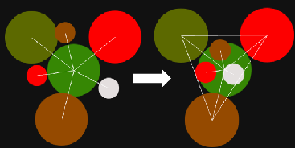
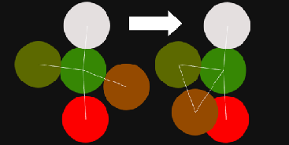

This algorithm handles 25 zones poorly:

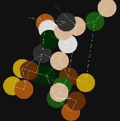

## 3. Create Voronoi Diagram from circle centers

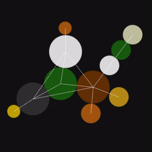

1. Find bounding box of circles
2. Make a square bounding box, containing initial one
3. Compute integer circle centers coordinates, relative to square bounding box
4. Create `Array2` with width and height equal to `mapSize`, assign circle centers to cells (marked as yellow dots in
   gif)
5. For each cell find the nearest zone center, assign `cell.zone = center.zone`
6. Change cell type to `CellType.EDGE` for cells that have neighbours of different zone.

## 4. Place castles and mines in each zone

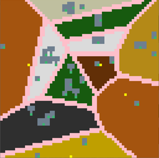

Now zone can have only one castle which is placed in center of mass. All mines are placed in a circle with center of
mass as its center.

### Requirements

* Each entrance (green cell) should be reachable (TODO make mine entrances reachable)

## 5. Create obstacle mask

Randomly assign obstacle type to cells. Then execute [celullar automata]() step to group obstacles. Darker cells
represent obstacle cells. Edge cell is an obstacle that is not affected by cellular automata step.

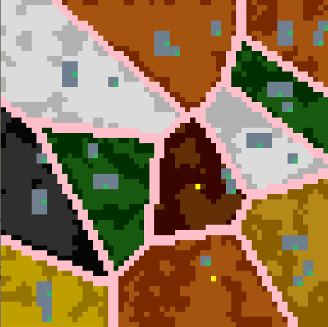

## 6. Add passages and portals

### Passages

Traverse all regular and road connections, choose random edge cell between respective zones and create a passage by
changing cell type to `CellType.ROAD` (blue cells on an image). If there are none such edge cells, create portal.

### Portals

For portal connections and unsuccessful regular connections, pick two random empty cells in respective zones and add
portals of same type to them.


## 7. Connect isolated parts inside zones

Using [A*](https://www.redblobgames.com/pathfinding/a-star/introduction.html) pathfinding algorithm.

Up, down, left, right moves are allowed. Cost of moving to:

* empty cell is zero,
* obstacle cell is 2
* edge or road cell is infinity

While there are two empty cells in one zone, for which cost of moving from one to another is not zero, the algorithm
will change all the cells' types of their connecting path to `CellType.EMPTY`.

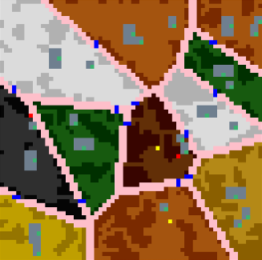

## 8. Connect castles and mines with roads

*This step gives unsatisfiable results. In step 3 it should be considered that cost of moving to a road is smaller than
moving to an empty cell. That way, road structure won't be flooding entire map like it does now.*

1. Compute all the distances between **key** objects in a zone. There objects will represent vertices. Key objects are:
    * Castles
    * Mines
    * Portals (if opposite is not stated in config)
    * Passages
2. Sequentially choose the shortest edge between unconnected components, repeat until graph is a tree.
3. Draw road for each edge between key objects.
4. Optimize (reduce) drawn roads by removing right bottom corner of each "road block" of size 2x2.
5. Remove "hanging roads" - roads that are not connected to key objects or other roads. It iterates over all cells and
   checks each cell one time, so there are still some hanging roads left (sometimes after 4th step essential roads
   become unconnected, like in bottom left corner of a picture below. That's why it does not remove all hanging roads).

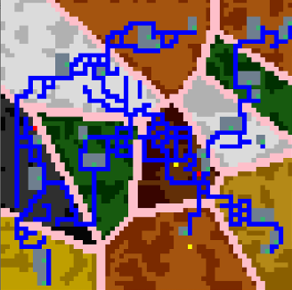

## 9. Add treasures and guards

Adding resources (orange cells) is simple: choose random empty cell and put a resource there. Repeat until zone richness
is less than zero. Costs and probabilities for each treasure are stated in config file

Guards (purple cells) are added nearby passages and mines' entrances, if stated in the template.

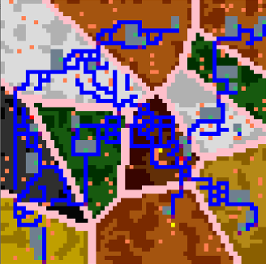

## 10. Export to .hmm

*Exporting to file ``fileNameHH_MM_SS.hmm``, where time is GMT0.*

hmm is a file format for PPH map editor. Exporting happens in [Writer class](src/commonMain/kotlin/external/Writer.kt).
To do it, I found editor's [sources](https://github.com/sigman78/pocketheroes/tree/master) in C++ and rewrote them to
Kotlin.

### Notes on export

This step was quite interesting to implement.

#### Obstacle mask

Firstly, I had to figure out how to transform obstacle mask into individual obstacle tiles. Turns out that all map
object for editor are written in one huge xml file [hmm.xml](src/commonMain/resources/hmm.xml). Then I found out that
obstacles have n `PassModifier` attributes that state which cells are occupied by it.

I grouped all needed obstacles by number of pass modifiers into [0.xml](src/commonMain/resources/0.xml)
, [1.xml](src/commonMain/resources/1.xml), [2.xml](src/commonMain/resources/2.xml)
, [3.xml](src/commonMain/resources/3.xml), [4.xml](src/commonMain/resources/4.xml)
, [9.xml](src/commonMain/resources/9.xml) files. Also, there were no cues for the editor to know which obstacles are
applicable for which surface (so I manually added `Surf` attributes to each obstacle, labelling compatible surfaces).

After all the preparatory steps were finished, it wes time to finally replace obstacle mask with individual tiles. This
done in following order:

1. Replace 3x3 obstacle blocks by 3x3 obstacles. Remove blocks from obstacle
2. Replace 2x2 obstacle blocks by 2x2 obstacles

#### Artifacts

Secondly, artifacts were extracted to [artifacts.xml](src/commonMain/resources/artifacts.xml), to pick random one
for [treasures and guards](https://github.com/Alex5041/MapGen-KorGE#9-add-treasures-and-guards) step

### Examples

Export examples, viewed in editor and in generator:

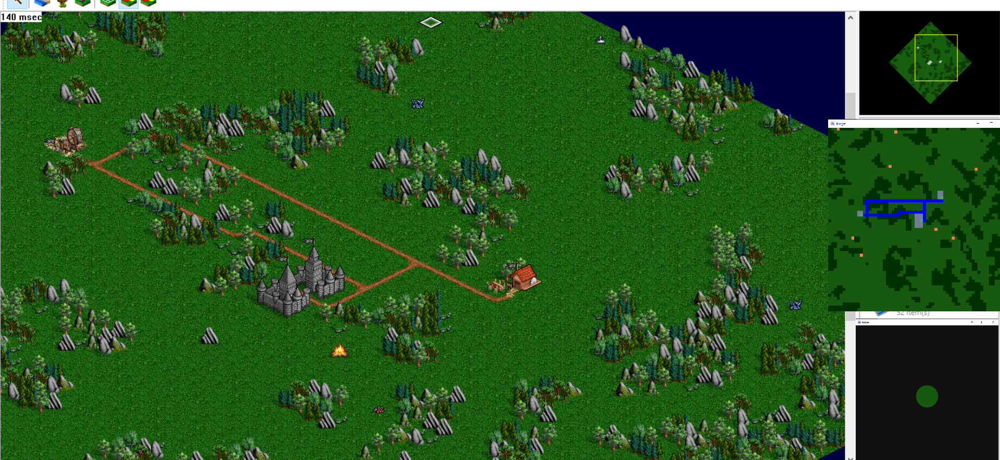
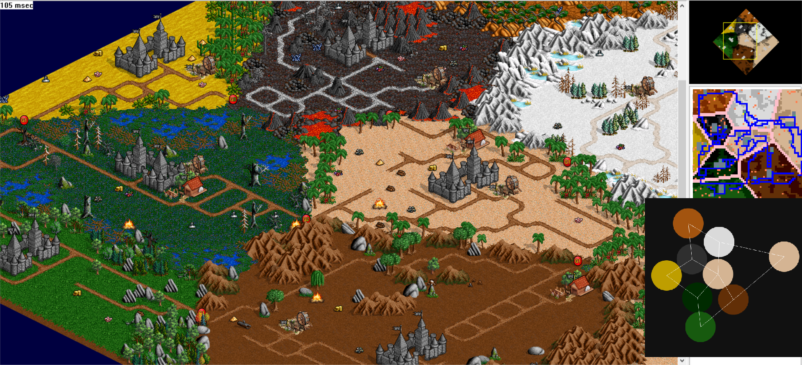

